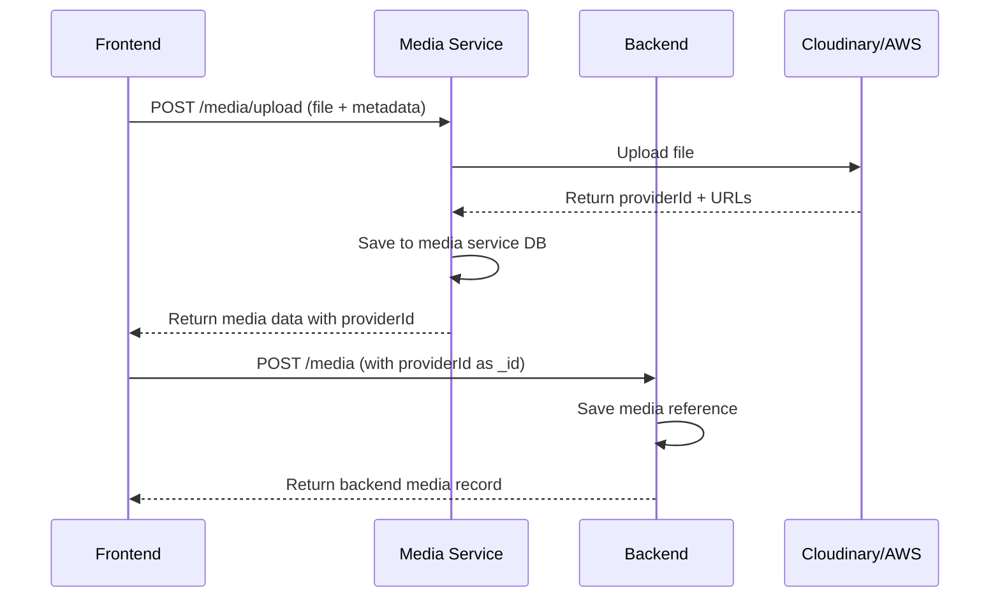
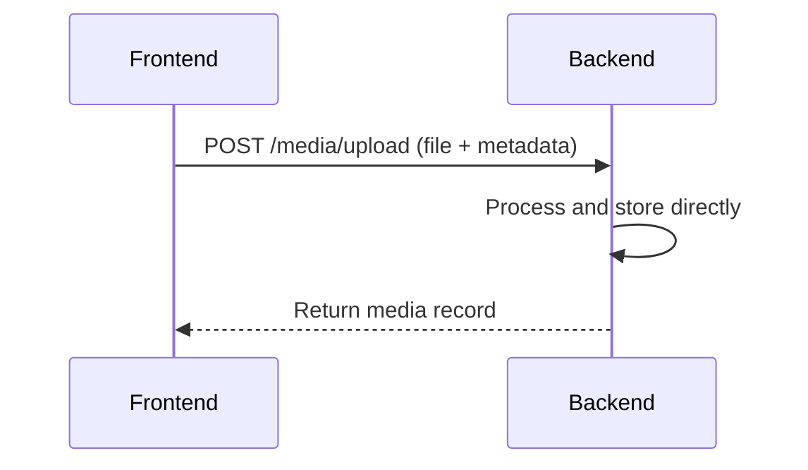

# Media Architecture

## Overview
This document describes the clean, separation-of-concerns architecture for media handling in the BiteScout application.

## Architecture Principles
- **Media Service**: Handles media processing only (upload, optimization, storage)
- **Backend**: Manages business logic and user data
- **Frontend**: Orchestrates the flow between services

## Service Responsibilities

### Media Service (`apps/media-service`)
**Purpose**: Pure media processing service
- ✅ Upload files to Cloudinary/AWS S3
- ✅ Generate optimized variants
- ✅ Store media metadata in its own database
- ✅ Provide optimized URLs
- ❌ No business logic
- ❌ No user management
- ❌ No backend communication

### Backend (`apps/backend`)
**Purpose**: Business logic and user data management
- ✅ Store media references (with `providerId` linking to media service)
- ✅ User authentication and authorization
- ✅ Media metadata management (title, description, associations)
- ✅ Business rules and validation
- ❌ No direct file processing

### Frontend (`apps/web`)
**Purpose**: User interface and service orchestration
- ✅ Handle file uploads
- ✅ Orchestrate between media service and backend
- ✅ Manage user experience
- ✅ Handle errors and fallbacks

## Upload Flow

### For Images (Optimized Flow)

### For Other Media Types

## ID Management

### Media Service Database
- **Primary Key**: MongoDB `_id` (auto-generated)
- **Provider ID**: `providerId` (from Cloudinary/AWS S3)

### Backend Database
- **Primary Key**: MongoDB `_id` (set to `providerId` from media service)
- **Provider ID**: `providerId` (same as media service)

### Result
- ✅ Same `providerId` across both databases
- ✅ Backend `_id` = Media Service `providerId`
- ✅ Perfect ID synchronization

## API Endpoints

### Media Service
- `POST /media/upload` - Upload file
- `GET /media/:providerId` - Get media by provider ID
- `GET /media/:providerId/optimized` - Get optimized URL

### Backend
- `POST /media` - Create media reference
- `GET /media/:id` - Get media by ID
- `PUT /media/:id` - Update media metadata
- `DELETE /media/:id` - Delete media reference

## Error Handling

### Frontend Orchestration
- If media service upload fails → Show error to user
- If backend sync fails → Return media service response (with warning)
- If optimized URL fails → Fallback to original URL

### Graceful Degradation
- Media service unavailable → Upload directly to backend
- Backend unavailable → Store in media service only
- Both available → Full optimized flow

## Benefits

1. **Separation of Concerns**: Each service has a clear, focused responsibility
2. **Scalability**: Media service can scale independently
3. **Reliability**: Graceful degradation when services are unavailable
4. **Maintainability**: Clear boundaries make code easier to understand
5. **Performance**: Optimized images with fallback to originals

## Configuration

### Environment Variables
- `MEDIA_SERVICE_URL` - Media service endpoint
- `BACKEND_URL` - Backend API endpoint
- `CLOUDINARY_*` - Cloudinary configuration
- `AWS_*` - AWS S3 configuration

### Database Connections
- Media Service: `MONGODB_CONNECTION_STRING` (media service database)
- Backend: `MONGODB_URI` (main application database) 